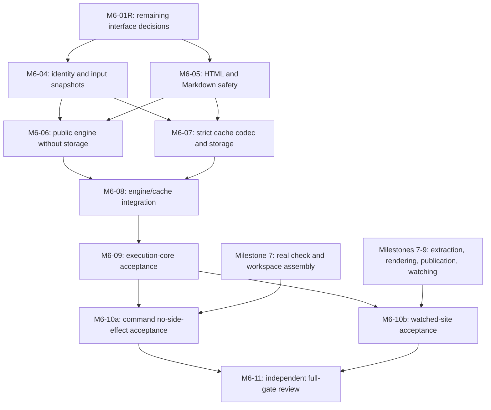

# Remaining Milestone 6 work

This plan was prepared against the repository at
`b31b44cbf2f39fcc2d11c5ac6574f86023a9df0e` on September 23, 2026. It updates the
scheduling in [the implementation design](execution-implementation.md), without
changing the [output policy](../spikes/authored-execution-contract.md),
[cache contract](../spikes/page-execution-cache.md), or milestone exit gate.
Task names such as M6-10 refer to work within Milestone 6, not to Milestone 10.

The planning pass delegated three source audits through Coterie run
`cr-01M36CJ6S3PH09F9VXEKTD8JFG` and registered twelve follow-up tasks in group
`m6-remaining`. Those tasks include two external evidence gates, M6-X7 and
M6-X789; they are not assignments to implement entire later milestones.
M6-01R records the reviewed integration contracts and reference artifact. The
identity and output-safety foundations are now implemented, together with the
shared validated records and startup port ownership. The task descriptions
record ownership, dependencies, acceptance, and coordinator handoffs.

## Closeout on September 23, 2026

The user limited this run to finishing the work already underway. Identity
(M6-04), output safety (M6-05), the shared prepared inputs and validated result
records, and the startup port fix are integrated and accepted. No engine or
cache implementation was launched. Milestone 6 remains open.

A future run can implement M6-06 (the production engine) and M6-07 (cache
storage) in parallel against these accepted interfaces. Their results must join
in M6-08 before M6-09 can establish execution-core acceptance. M6-10a, M6-10b,
and M6-11 retain the command and watched-site prerequisites below. This
closeout does not authorize starting those tasks.

The shared records preserve immutable validation evidence, exact canonical
representation hashes, typed diagnostic associations, and the complete staged
asset set. They do not prove that a production engine executes, cleans up, or
revalidates a page. The startup fix retains process-local port claims through
supervised cleanup; unrelated external port races remain outside that guarantee.

## Starting point

The shared execution records, QMD preparation, Jupyter discovery and supervised
session runner, typed output reducer, inert fragment parser, and content-addressed
image staging are implemented. Reuse their tests and extend them through the
public engine. Do not schedule M6-01, M6-02, or M6-03 again.

The production `ExecutionEngine` implementation and cache module are absent.
The identity and output-safety modules and shared validated records are present.
`check`, `build`, and `serve` still return not-implemented errors. Existing real
Python/R tests prove startup and sequential state, but not public-engine rich
output or cache restoration. Existing timeout,
interruption, process-reaping, and staging tests do not prove watched-site
preservation. These distinctions explain why several roadmap items remain open.

## Dependencies and assignment order



The critical sequence is M6-01R, the slower of M6-04/M6-05, the slower of
M6-06/M6-07, M6-08, and M6-09. M6-10 adds a separate dependency on later
milestone work. Identity and safety can proceed together after the interface
decisions. Engine composition and cache storage can then proceed together:
storage receives explicit input records and never owns a session. M6-08 is their
join and must have one owner.

Use two implementation workers and an independent reviewer. The lead owns shared
interfaces, integration, and acceptance. The current Coterie configuration allows
only one active reviewer role, so schedule reviews serially. A worker may prepare
test cases for a later task while waiting, but must not implement against guessed
interfaces or merge ahead of its prerequisites.

| Task | Owner and paths | Dependencies | Deliverable and acceptance |
| --- | --- | --- | --- |
| M6-01R | Lead; shared execution records, module exports, diagnostics, design | Existing M6-01/02/03 | Record the decisions below, with exact consumer-facing signatures and wire examples before workers depend on them. Preserve workspace-v1 semantics. |
| M6-04 | Identity worker; `src/execution/identity.rs`, child modules, `tests/execution_identity.rs` | M6-01R | Canonical encoding and strict decoding, exact key vectors, private launch identity, input snapshots and post-cleanup revalidation, portable observations. No cache storage or kernel startup. |
| M6-05 | Safety worker; `src/execution/output_safety.rs`, child modules, `tests/execution_output_safety.rs` | M6-01R; existing assets | Validated HTML/Markdown wrappers, decoded URL checks, typed image bindings, separate live/restore constructors, canonical accepted HTML, and complete referenced-asset traversal. No cache filesystem or session edits. |
| M6-06 | Engine worker; production engine, Jupyter page/session/discovery/process modules, protocol tests | M6-04, M6-05 | Implement `ExecutionEngine` without storage: authorize, discover, snapshot inputs, start once, reduce each cell under supervision, clean up, revalidate, construct provenance, and retain assets. Fatal validation prevents the next submission. |
| M6-07 | Cache worker; `src/execution/cache.rs`, child modules, `tests/execution_cache.rs` | M6-04, M6-05 | Exact cache DTOs, whole-entry validation and restore, immutable atomic publication, nonblocking per-key locks, warning replay, and corruption/storage/concurrency tests. No session ownership. |
| M6-08 | Engine worker; same engine/session ownership | M6-06, M6-07 | Lookup after current readiness; hits submit zero cells, misses execute in the same session. Both paths await cleanup and input revalidation. Publish only complete successful results. |
| M6-09 | Acceptance worker; `tests/milestone_six.rs`, execution snapshots, matrix, documentation | M6-08 | Production-engine Python/R rich-output and stateful restoration tests, authority sentinels, relocation/provenance checks, and failure/cleanup coverage. Establish the execution-core gate only. |
| M6-10a | Command integration owner; command tests and acceptance matrix | M6-09 and real Milestone 7 checking | Prove real `check` and disabled command paths avoid discovery, execution, cache, and execution-asset side effects. Do not wait for the watcher to test `check`. |
| M6-10b | Command integration owner; later command tests and acceptance matrix | M6-09 and Milestones 7-9 publication/watch slices | Prove safe output rendering, snapshot/site transactions, disabled paths of the remaining commands, and watched-build retention. Reuse later milestone implementations. |
| M6-11 | Independent reviewer; acceptance report and roadmap evidence | M6-09, M6-10a, M6-10b | Review every remaining checkbox and literal exit-gate clause against integrated code and passing evidence. Only then mark the full milestone complete. |

The lead alone integrates changes to `Cargo.toml`, `Cargo.lock`,
`src/execution.rs`, shared records, shared IR, and diagnostics. Serialize reducer
adapter changes and the shared Jupyter fixture dispatcher too. Give each change
one explicit owner, even when several tasks need it. Module registration is a
small integration change, not grounds for parallel edits to a shared entry point.

## Decisions that precede implementation

The concrete signatures, wire shapes, ownership decisions, and complete artifact
fixture for these six items are in the
[M6-01R integration contracts](execution-integration-contracts.md). The list
below records why those decisions were needed; it does not claim the consumer
implementations have landed.

M6-05 acceptance includes the now-integrated shared prepared/result records
and private accessors, using its reviewed wrappers and accepted M6-04 types.
A future resumed run may release engine and cache workers together against
those records. Their existing M6-04/M6-05 dependency edges remain sufficient;
both tasks remain unassigned at this closeout.

1. **Keep validation evidence alive.** `AcceptedRepresentation` and `ReducedPage`
   currently hold portable records; they cannot carry the planned private
   `ValidatedMarkdown`/`ValidatedHtml` wrappers. Choose a nonserializable carrier
   with immutable bindings keyed to final cell, slot, and representation. Display
   updates and clears must replace or discard that evidence together with the
   output. Cache encoding consumes that evidence. Reconstruct it through active
   validation on restore; deserialization never grants trust. Keep the returned
   carrier paired immutably with its portable projection, or check that
   association before use. Mutating the currently public result record must not
   leave stale wrappers that appear to validate the changed content. Repeated
   update events can reuse a producer slot, so producer/slot alone is not a key.
2. **Retain nested image assets.** `OutputReducer::finish` currently collects
   top-level `Asset` representations only. The final asset set must also include
   every image binding in surviving Markdown/HTML alternatives, including hidden
   output, and exclude superseded bindings. Assign the reducer adapter to the
   engine owner, with safety traversal supplied by M6-05.
3. **Unify representation fingerprints.** The text adapter currently hashes raw
   Markdown text. The cache contract requires a structured fragment digest that
   includes typed image references. Define one canonical content representation
   shared by live output and restoration, along with error and unsupported-output
   digests. M6-04 owns the encoder/hash primitives; M6-05 owns validated content;
   M6-07 owns the artifact DTO. Preserve parallel work by having M6-05 return
   validated canonical content and letting the M6-06 adapter apply M6-04's hash
   primitives; M6-07 uses that same mapping. Neither engine nor safety may depend
   on cache filesystem code merely to compute a digest.
4. **Supply explicit local identity inputs.** `ExecutionContext` currently has
   one repository root and no cache root; the key contract needs declared roots,
   resolved launch identity, exact component/build/target observations, and stable
   source/environment bytes. Define their local owner and engine construction
   inputs. The engine projects private discovery/runtime data into identity
   records. Hash and spawn from the same resolved launch plan: the current
   process adapter resolves the executable during launch, and the selected
   kernel's `executable_path` is a captured search path, not the resolved binary.
   Check prepared source against the snapshot before execution. M6-04 must not
   depend on private session types or launch a kernel. Derive exact component
   versions from the build, not Cargo version ranges or synthetic vector values.
   Supply immutable authored link/anchor context to M6-05's live and restored
   validators too: preparation currently discards its anchor map. Keep semantic
   links unresolved until the current site context is available.
5. **Freeze the remaining cache wire shapes.** `PageExecutionRecord` is not
   `execution-result-v1`. Specify nested fragment/image encodings, required nulls,
   structured diagnostic arguments, and how current discovery diagnostics stay
   separate from replayed execution diagnostics. Specify stable ordering and
   index remapping when combining reducer/session warnings, including later
   failures, without dropping or duplicating earlier warnings. Do not infer
   structured arguments by parsing human-readable messages or serialize arbitrary IR with
   derived Serde and call it canonical. Freeze a storage-independent decoded
   representation interface and a complete artifact fixture here: M6-05 restore
   constructors cannot depend on DTO definitions first invented by M6-07, which
   itself depends on M6-05. M6-07 maps this agreed interface into the artifact.
6. **Own the ready session during cache I/O.** Preserve cancellation and process
   exit supervision between readiness and execution/shutdown. Agree on how lookup
   errors reach the owner and how primary, cleanup, and rollback failures survive.
   A validated hit is provisional until cleanup and input revalidation succeed.
   Test cancellation and kernel death during lookup, and discard partially staged
   rejected candidates before fresh execution without contaminating its asset set.

These decisions complete the existing design's integration boundaries. They do
not authorize a new sanitizer policy, weaker cache validation, or a schema change
hidden inside an adapter.

## Acceptance and external gates

M6-04 must match the checked-in canonical/key vectors byte for byte, reject
duplicate keys and invalid encodings, and exercise invalidation for each key
dimension. Relocation, reordered declared inputs, and equivalent defaults retain
identity; changed source, executable, runtime, policies, or deadlines do not.
Changed bytes, containment, or launch identity after cleanup fail the attempt
without automatically rerunning authored code.

M6-05 must cover active/obfuscated markup, remote and escaping images, inert
generated fences, repeated image targets with distinct bindings, safe alternatives,
and hidden output. Missing or escaping local assets are fatal, including in an
unselected alternative. Restore validates typed references against verified bytes
without reopening the original generated path.

M6-06 through M6-09 must cover cross-cell updates/clears, allowed errors, skipped
and hidden cells, figure validation, cancellation/drop, timeouts, missing kernels,
corrupted entries, concurrent publication, storage failure, and changed inputs.
Compare fresh and cached portable records and asset bytes, allowing only the
documented origin and build-diagnostic differences. A hit still starts and cleans
up the configured kernel to observe its current runtime, but submits no cells.
No failed attempt returns partial publishable assets or a stale cached result.

The full gate has three external prerequisites:

| External prerequisite | Required M6 evidence | Why the execution core cannot close it |
| --- | --- | --- |
| Milestone 7: workspace assembly, real `check`/`extract`, atomic snapshots | Real `check` and disabled collections never discover/start kernels, access cache, or write execution assets; failed extraction preserves the previous snapshot. | A stub returning an error or a preparation-only test proves no successful command behavior. |
| Milestone 8: snapshot-backed renderer and atomic site publication | Safely render validated output and typed image bindings; restore semantic links in the current site context; preserve the old site on generation failure. | The current rendering primitives do not build or publish a site. |
| Milestone 9: composed `build` and watched `serve` | A real failed watched rebuild retains the last successful site, reaps kernels, and ignores cache/output changes. | Library cleanup tests cannot exercise a watcher or publication transaction. |

Do not make those entire milestones depend on completion of Milestone 6. Their
static assembly/snapshot/generator work can proceed with execution disabled.
Execution integration depends on the M6 core. M6-10 then tests the joined system;
this avoids a circular milestone dependency. Keep the compound timeout/watched-site
checkbox and full command-side-effect checkbox open until their external evidence
exists. The Milestone 3 execution-observation subitem can close when M6-06/09 prove
actual observations; its separate R-extractor requirement remains independent.

The acceptance matrix and case registry currently assign some literal `build`
and `check` scenarios to Milestone 6. M6-09 must annotate or split those scenarios
so its library evidence cannot be mistaken for command acceptance. M6-10a/10b
retain responsibility for the original command guarantees.

## Validation and handoff

For each implementation task, add a failing observable test before implementing
the behavior. Use protocol fixtures for deterministic failure cases and the
declared Python/R kernels for production-engine acceptance. Review snapshot
changes; never overwrite them blindly.

Bypass tests must exercise an implemented production preparation/dispatch path.
A guard around a test-only fake engine is insufficient evidence for a missing
production caller. M6-09 reports the library paths that exist; M6-10 tests the
actual command paths. Execute compile-fail trust-boundary examples with
`cargo test --locked --doc` when those examples are introduced; building rustdoc
alone does not run them.

Run the relevant focused tests and the required formatting, Clippy, all-target
tests, and rustdoc checks in `devenv shell`, following [the development commands](../../README.md#development).
Run dependency-policy checks when dependencies change. Do not treat the historical
M6-01 ledger as validation of new work. Record command, cwd, selected permission
policy, result, and diagnostic. Distinguish Nix/cache or `.devenv` access failures
from Git access failures, and send blockers durably to the coordinator.

Review and validate each assignment before the authorized coordinator commits
its intended paths. Integrate its committed result, validate the integrated
target, and accept the task before releasing dependent implementation. A worker's
submission or provider exit alone does not satisfy a dependency.

This planning change is validated by source inspection, independent delegated
reports, local-link checks, and `git diff --check`. It does not claim a new passing
execution baseline or mark implementation checkboxes complete.

Planning validation used non-login Bash in `/home/jola/projects/diplodocus` with
the selected `use_default` project-write policy. `git diff --check` passed, and
a Python read-only scan confirmed every local Markdown link target exists and
none of the three changed files contains trailing whitespace. Coterie
`task_show` confirmed all twelve follow-up dependency lists and that none had an
implementation assignment. No development-environment entry or runtime test was
needed for these documentation changes. No current environment-access claim is
made from the historical validation ledger.

## Closeout validation

The combined implementation is committed as
`36d93e0e19e5647d3749fc35888bb1d527c24e7f`, including identity, output safety,
shared validated records, and the startup port fix. Independent reviews found
no remaining material issues in the accepted scope. The coordinator verified
that integration preserved all reviewed files and that the worktree was clean.

Final checks ran in `/home/jola/projects/diplodocus`, using non-login Bash and
separately authorized `require_escalated` access to the documented environment:

```sh
devenv shell -- bash -c 'cargo fmt --all -- --check && cargo clippy --locked --all-targets --all-features -- -D warnings && cargo test --locked --all-targets && cargo test --locked --doc && RUSTDOCFLAGS="-D warnings" cargo doc --locked --no-deps'
```

Every command passed. The all-target suite passed 533 tests, and all 27 doctests
passed, with none failed or ignored. The log is
`/tmp/diplodocus-m6-closeout-integrated-validation.log`. Formatting, Clippy, and
rustdoc also passed. Documentation closeout uses local-link, whitespace, and
diff checks; it does not change the validated implementation.

The shared-record worker's earlier branch, before startup integration, had one
startup protocol failure in its final suite. Its unchanged rerun passed 527
tests and 27 doctests. Both outcomes remain recorded in the
[shared-record ledger](execution-shared-records-validation.md) and durable
Coterie reports; the cause of that particular failure is unproven. The final
combined run above passed on its first attempt. The identity work's existing
dependency-license policy failures remain recorded in its
[validation ledger](execution-m6-04-validation.md); this closeout does not waive
them or claim that `cargo deny check` passes.
