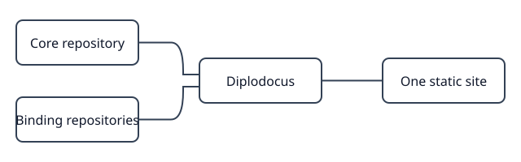

# Diplodocus

Diplodocus brings related Python and R packages into one documentation site.
Authored guides, API references, navigation, conceptual API groups, and search
share the same workspace.

The project is under development. Authored parsing and static extraction and
execution spikes work today. The site-building commands are still placeholders.
The examples in this guide specify the intended MVP workflow.

Start with the [quick start](quick-start.md), read about
[workspace configuration](configuration.md), or consult the [commands](cli.md).
The [executable example](../examples/stateful.qmd) provides a small deterministic
document for testing the project's own site.

## One explicit workspace

A configuration declares repository roots, packages, authored collections, and
relationships. Python and R APIs are parsed statically without importing or
loading the documented packages. Executing authored examples requires an
explicitly enabled QMD collection and an installed Jupyter kernel.

Diplodocus does not install dependencies or implicitly access the network.
Generated sites use local assets and portable, repository-relative source
locations.
