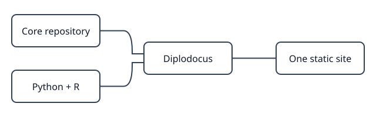

# Diplodocus

Diplodocus builds one site for related Python, R, and Julia packages. It combines
statically extracted API references with authored guides, shared navigation,
cross-references, and search. This guide is built by Diplodocus from the
project's own `diplodocus.toml`.

Start with [installation](installation.md) and the [quick start](quick-start.md).
Then configure your [workspace](configuration.md), write [authored pages](authoring.md),
and use the [command reference](cli.md) as you build. The
[executable example](../examples/stateful.qmd) shows a Python QMD page built
with the project's configured kernel.

Python, R, and Julia APIs are parsed without importing or loading the packages. Read
the [extraction guide](extraction.md) for the supported surfaces, the
[execution guide](execution.md) before enabling QMD cells, and the
[diagnostics guide](diagnostics.md) when a build reports a problem. A
[portable SQLite snapshot](snapshots.md) lets you generate the site separately
from extraction.
