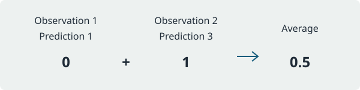

# Comparing predictions

Mean squared error measures how far predictions lie from observed responses.
Subtract each prediction from its observation, square the difference, and
average the squared differences. A value of zero means every prediction matches.

For observations `[1, 2]` and predictions `[1, 3]`, the squared errors are zero
and one. Their average is `0.5`.



## Python

Use [`pystats::tinystats.mean_squared_error`]:

```python
from tinystats import mean_squared_error

mean_squared_error([1.0, 2.0], [1.0, 3.0])
# 0.5
```

## R

Use [`rstats::mean_squared_error`]:

```r
library(tinystats)

mean_squared_error(c(1, 2), c(1, 3))
# [1] 0.5
```

## Julia

Use [`juliastats::TinyStats.mean_squared_error`]:

```julia
using TinyStats

mean_squared_error([1.0, 2.0], [1.0, 3.0])
# 0.5
```

All three functions require inputs with the same nonzero length. These snippets are
display examples; building the documentation does not execute them.

## Choose the next step

Compare this result with [`pystats::tinystats.mean_absolute_error`] or
[`rstats::mean_absolute_error`]. Read [Choosing a metric](choosing-a-metric.md)
for the tradeoffs, or [Inspecting residuals](inspecting-residuals.md) to see
which observations account for the error.
