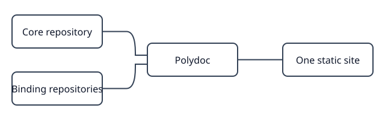

# Workspace layout

Polydoc combines the core project with the Python and R packages in one site.
The project guide can link directly to [`pyfoo::foo.fit`].

Return to the [project guide](../index.md).
